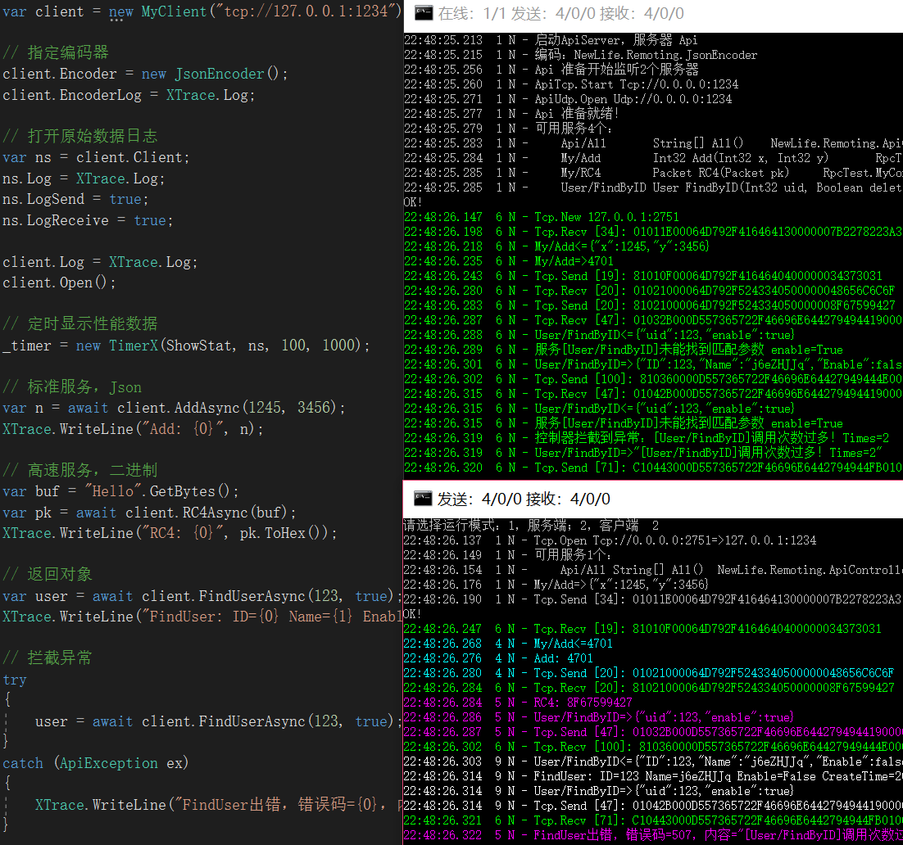

# NewLife.Net - 网络库组件

## 网络库历史  
X组件网络库一共经历了数代：  
1，2005年，APM模型，反向代理、点卡服务端  
2，2010年，SAEA模型，P2SP网络，单机7万连接  
3，2014年，物联网云平台，ApiServer单机84.5万连接  
4，2018年，高速RPC，ApiServer单机16万tps，NetServer单机2266万tps  
5，2020年，物联网，单机400万长连接  

## 说明文档  
[NewLife.Net——开始网络编程](https://newlifex.com/blood/net_server)  
[NewLife.Net——构建可靠的网络服务](https://newlifex.com/blood/net_agent)  
[NewLife.Net——网络压测单机2266万tps](https://newlifex.com/blood/net_benchmark)  
[NewLife.Net——管道处理器解决粘包](https://newlifex.com/blood/net_handler)  
[NewLife.Net——RPC框架NewLife.ApiServer](https://newlifex.com/blood/apiserver)  
[NewLife.Net——单机400万长连接压力测试](https://newlifex.com/blood/net_100w)  

## SRMP协议封包  
经过十多年实战经验积累以及多方共同讨论，[新生命团队](https://github.com/newlifex)制订了一种简单而又具有较好扩展性的`RPC（Remote Procedure Call）`协议。  
全称：`简易远程消息交换协议`，简称： `SRMP（Simple Remote Messaging Protocol）`  

SRMP主要定位于以下场景：  
1, 内网高速通信，大吞吐量（>100万tps）、低延迟（<1ms）  
2, 外网远程通信，稳定可靠，海量连接（>10万）  
3, 物联网硬件设备，容易简单实现协议  

### 通信协议  
标准网络封包协议：`1 Flag + 1 Sequence + 2 Length + N Payload`  
1个字节标识位，标识请求、响应、错误、加密、压缩等；  
1个字节序列号，用于请求响应包配对；  
2个字节数据长度N，小端字节序，指示后续负载数据长度（不包含头部4个字节），解决粘包问题；  
N个字节负载数据，数据内容完全由业务决定，最大长度65534=64k-2。  
扩展长度，Length为0xFFFF时，封包协议扩展4字节作为新长度，包头共8字节。

### 指令格式  
包头后的负载数据存放指令，默认采用Json序列化，utf-8编码  

请求：S服务名 + N请求参数
响应：S服务名 + 4响应码 + N响应数据

标准指令例子如下：  
请求，00012500 + 05 + Login + 1E + {user:"Stone",pass:"password"}  
响应，80011D00 + 05 + Login + 00000000 + 12 + {data:"大石头"}  
头部4字节，第一个字节最高位区分请求响应，第二个字节序列化，第三第四字节是长度，小字节序  

## 压力测试  
NewLife.Net压力测试，峰值4.2Gbps，50万pps，消息大小24字节，消息处理速度2266万tps！  
共集合20台高配ECS参与测试，主服务器带宽6Gbps、100万pps，16核心64G内存。另外19台共模拟400个用户连接，13*16+6*32=400，每用户发送2000万个消息，服务端收到后原样返回。  

## 新生命项目矩阵
各项目默认支持net8.0/net7.0/netstandard2.1/netstandard2.0/net4.61，旧版（2022.1225）支持net4.5/net4.0/net2.0  

|                               项目                               | 年份  | 说明                                                                                   |
| :--------------------------------------------------------------: | :---: | -------------------------------------------------------------------------------------- |
|                             基础组件                             |       | 支撑其它中间件以及产品项目                                                             |
|          [NewLife.Core](https://github.com/NewLifeX/X)           | 2002  | 核心库，日志、配置、缓存、网络、序列化、APM性能追踪                                    |
|    [NewLife.XCode](https://github.com/NewLifeX/NewLife.XCode)    | 2005  | 大数据中间件，单表百亿级，MySql/SQLite/SqlServer/Oracle/TDengine/达梦，自动分表        |
|      [NewLife.Net](https://github.com/NewLifeX/NewLife.Net)      | 2005  | 网络库，单机千万级吞吐率（2266万tps），单机百万级连接（400万Tcp）                      |
| [NewLife.Remoting](https://github.com/NewLifeX/NewLife.Remoting) | 2011  | RPC通信框架，内网高吞吐或物联网硬件设备场景                                            |
|     [NewLife.Cube](https://github.com/NewLifeX/NewLife.Cube)     | 2010  | 魔方快速开发平台，集成了用户权限、SSO登录、OAuth服务端等，单表100亿级项目验证          |
|    [NewLife.Agent](https://github.com/NewLifeX/NewLife.Agent)    | 2008  | 服务管理组件，把应用安装成为操作系统守护进程，Windows服务、Linux的Systemd              |
|     [NewLife.Zero](https://github.com/NewLifeX/NewLife.Zero)     | 2020  | Zero零代脚手架，基于NewLife组件生态的项目模板，Web、WebApi、Service                    |
|                              中间件                              |       | 对接知名中间件平台                                                                     |
|    [NewLife.Redis](https://github.com/NewLifeX/NewLife.Redis)    | 2017  | Redis客户端，微秒级延迟，百万级吞吐，丰富的消息队列，百亿级数据量项目验证              |
| [NewLife.RocketMQ](https://github.com/NewLifeX/NewLife.RocketMQ) | 2018  | RocketMQ纯托管客户端，支持Apache RocketMQ和阿里云消息队列，十亿级项目验                |
|     [NewLife.MQTT](https://github.com/NewLifeX/NewLife.MQTT)     | 2019  | 物联网消息协议，MqttClient/MqttServer，客户端支持阿里云物联网                          |
|      [NewLife.IoT](https://github.com/NewLifeX/NewLife.IoT)      | 2022  | IoT标准库，定义物联网领域的各种通信协议标准规范                                        |
|   [NewLife.Modbus](https://github.com/NewLifeX/NewLife.Modbus)   | 2022  | ModbusTcp/ModbusRTU/ModbusASCII，基于IoT标准库实现，支持IoT平台和IoTEdge               |
|  [NewLife.Siemens](https://github.com/NewLifeX/NewLife.Siemens)  | 2022  | 西门子PLC协议，基于IoT标准库实现，支持IoT平台和IoTEdge                                 |
|      [NewLife.Map](https://github.com/NewLifeX/NewLife.Map)      | 2022  | 地图组件库，封装百度地图、高德地图和腾讯地图                                           |
|       [NewLife.IP](https://github.com/NewLifeX/NewLife.IP)       | 2022  | IP地址库，IP地址转物理地址                                                             |
|                             产品平台                             |       | 产品平台级，编译部署即用，个性化自定义                                                 |
|           [AntJob](https://github.com/NewLifeX/AntJob)           | 2019  | 蚂蚁调度，分布式大数据计算平台（实时/离线），蚂蚁搬家分片思想，万亿级数据量项目验证    |
|         [Stardust](https://github.com/NewLifeX/Stardust)         | 2018  | 星尘，分布式服务平台，节点管理、APM监控中心、配置中心、注册中心、发布中心              |
|      [NewLife.ERP](https://github.com/NewLifeX/NewLife.ERP)      | 2021  | 企业ERP，产品管理、客户管理、销售管理、供应商管理                                      |
|         [CrazyCoder](https://github.com/NewLifeX/XCoder)         | 2006  | 码神工具，众多开发者工具，网络、串口、加解密、正则表达式、Modbus                       |
|           [XProxy](https://github.com/NewLifeX/XProxy)           | 2005  | 产品级反向代理，NAT代理、Http代理                                                      |
|        [HttpMeter](https://github.com/NewLifeX/HttpMeter)        | 2022  | Http压力测试工具                                                                       |
|         [GitCandy](https://github.com/NewLifeX/GitCandy)         | 2015  | Git源代码管理系统                                                                      |
|          [SmartOS](https://github.com/NewLifeX/SmartOS)          | 2014  | 嵌入式操作系统，完全独立自主，支持ARM Cortex-M芯片架构                                 |
|          [SmartA2](https://github.com/NewLifeX/SmartA2)          | 2019  | 嵌入式工业计算机，物联网边缘网关，高性能.NET6主机，应用于工业、农业、交通、医疗        |
|                           菲凡物联FIoT                           | 2020  | 物联网整体解决方案，建筑、环保、农业，软硬件及大数据分析一体化，单机十万级点位项目验证 |
|                           NewLife.UWB                            | 2020  | 厘米级（10~20cm）高精度室内定位，软硬件一体化，与其它系统联动，大型展厅项目验证        |

## 新生命开发团队
  

新生命团队（NewLife）成立于2002年，是新时代物联网行业解决方案提供者，致力于提供软硬件应用方案咨询、系统架构规划与开发服务。  
团队主导的开源NewLife系列组件已被广泛应用于各行业，Nuget累计下载量高达60余万次。  
团队开发的大数据核心组件NewLife.XCode、蚂蚁调度计算平台AntJob、星尘分布式平台Stardust、缓存队列组件NewLife.Redis以及物联网平台NewLife.IoT，均成功应用于电力、高校、互联网、电信、交通、物流、工控、医疗、文博等行业，为客户提供了大量先进、可靠、安全、高质量、易扩展的产品和系统集成服务。  

我们将不断通过服务的持续改进，成为客户长期信赖的合作伙伴，通过不断的创新和发展，成为国内优秀的IT服务供应商。  

`新生命团队始于2002年，部分开源项目具有20年以上漫长历史，源码库保留有2010年以来所有修改记录`  
网站：https://newlifex.com  
开源：https://github.com/newlifex  
QQ群：1600800/1600838  
微信公众号：  
  
